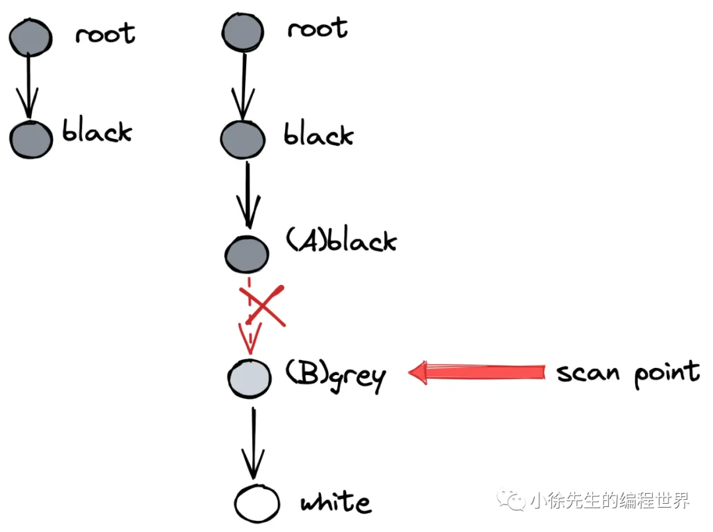
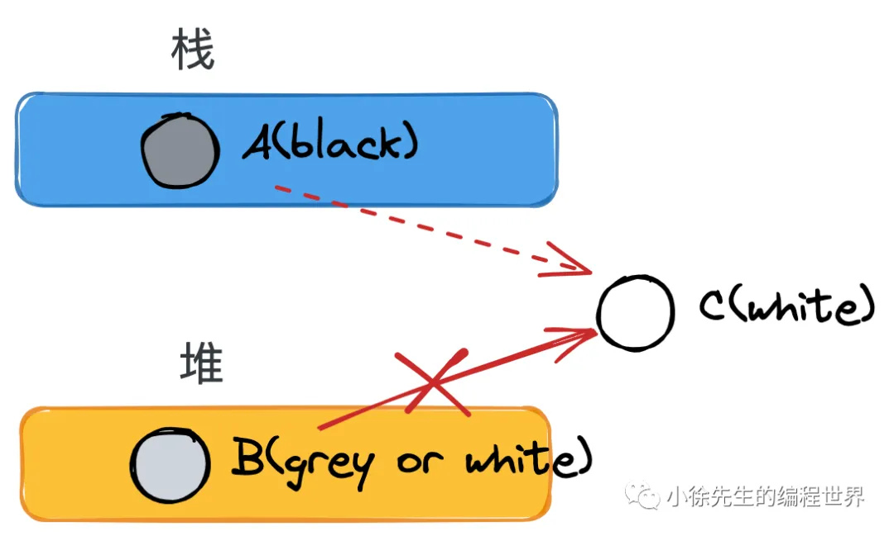
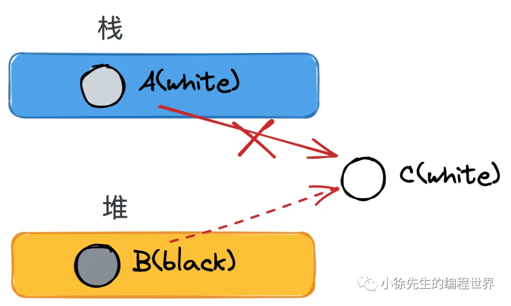

## gc 方法

### 标记法

通过算法把存活的对象标记出来, 然后清理掉没有被标记的对象

### 标记压缩

标记法的改进版本, 在标记完成后, 把存活的对象移动到内存的一端, 然后清理掉另一端的内存

### 半空间复制

java 使用的 gc 方法, 把内存分成两块, 每次只使用一块, 当这一块用完后, 把存活的对象复制到另一块, 然后清理掉当前块

代价很大, 一是要两个空间, 二是要复制对象, 但是 java 使用的新生代和老年代的概念, 新生代使用半空间复制, 老年代使用标记压缩, 这样可以减少复制的代价

### 引用计数

每个对象维护一个引用计数器, 当有新的引用指向该对象时, 计数器加一, 当引用被删除时, 计数器减一, 当计数器为零时, 该对象就可以被回收

引用计数的缺点是无法处理循环引用的问题, 另外每次引用的增加和删除都要修改计数器, 代价比较大

python 使用的就是引用计数, 但是也有一个垃圾回收器, 用来处理循环引用的问题

## 三色标记法

在 go 的 1.8 版本中, 引入了三色标记法来进行垃圾回收

Golang GC 中用到的三色标记法属于标记清扫-算法下的一种实现，由荷兰的计算机科学家 Dijkstra 提出，下面阐述要点：

- 对象分为三种颜色标记：黑、灰、白
- 黑对象代表，对象自身存活，且其指向对象都已标记完成
- 灰对象代表，对象自身存活，但其指向对象还未标记完成
- 白对象代表，对象尙未被标记到，可能是垃圾对象
- 标记开始前，将根对象（全局对象、栈上局部变量等）置黑，将其所指向的对象置灰
- 标记规则是，从灰对象出发，将其所指向的对象都置灰. 所有指向对象都置灰后，当前灰对象置黑
- 标记结束后，白色对象就是不可达的垃圾对象，需要进行清扫.

### stw

在 golang 1.5 之前, gc 会停止用户的协程, 完成 gc 后再恢复用户协程, 这种方式叫做 stop the world, stw

由于这种中断可能有很长的时间, 所以在 golang 1.5 之后, 引入了并发 gc, 也就是在用户协程运行的同时, 进行 gc

并发的 gc 也不是完全没有 stw, 在某些阶段, 还是需要暂停用户协程的, 但是时间大大缩短了

不过引入了并发, 那么就要保证用户的并发安全了

### 并发导致的问题

#### 标记遗漏

现有AB两个协程, B 持有对C 的引用

GC 下 A 扫描完成, 置黑, 此时对象B是灰色

用户 A 建立了对 C 的引用

B 删除对 C 的引用

GC 继续扫描 B, 发现 B 指向 C 的引用不存在, 因为 C 没有被标记, 所以 C 被误回收

#### 标记错误,多标

多标问题指的是在用户协程与GC协程并发执行的场景下，部分垃圾对象被误标记从而导致GC未按时将其回收的问题. 这一问题产生的过程如下：

对象 A 持有对 B 的引用

GC 扫描 A，将 B 标记为灰色

用户协程删除 A 对 B 的引用

这会导致 B 无法被 GC 正确识别为垃圾对象，从而未能及时回收，但问题不大

### golang 的内存碎片

标记清扫算法会导致内存的碎片, go 的解决办法就是依靠其内存分配,把小对象分配到固定大小的内存块中, 这样就可以靠内存块的回收来解决碎片问题

## 屏障机制

漏标问题的本质在于一个扫描完成的黑对象指向了一个被灰/白对象删除引用的白色对象

1. 黑色对象指向了白色对象

2. 灰/白对象删除了白色对象的引用

3. 1,2 是同一个对象

4. 1 发生在 2 之前

一套用于解决漏标问题的方法论称之为强弱三色不变式：

- 强三色不变式：白色对象不能被黑色对象直接引用（直接破坏（1））

- 弱三色不变式：白色对象可以被黑色对象引用，但要从某个灰对象出发仍然可达该白对象（间接破坏了（1）、（2）的联动）

## 插入写屏障

屏障复制是指在完成某个动作前, 会先完成屏障设置的内容

插入写屏障 (Dijkstra) 的目标是实现强三色不变
保证一个黑色对象指向一个白色对象前, 会先把白色对象设为灰色, 再建立引用

## 删除写屏障

删除写屏障( Yuasa barrier) 是实现弱弱的三色不变式
保证一个白色对象即将被上游删除引用前, 都会先置灰色, 然后再删除引用

## 混合写屏障

而在 go 里面, 这两种屏障机制都被使用, 这是因为 go 在栈空间没有使用屏障机制

原因在为栈空间的操作频繁, 如果使用插入写屏障, 会带来很大的性能开销

下面说说明混合写屏障可以解决不在栈空间使用, 依然可以保证三色不变式

> [!NOTE]
> go 对栈的标记是原子操作, 要么整个栈都被标记, 要么整个栈都不被标记

### case 1

A 在栈上, 黑色

B 在堆上, 白色

c 在堆上, 被 B 引用, 白色

A 建立对 C 的引用, 栈对象不使用屏障,故无其他操作

B 删除对 C 的引用, 触发删除写屏障, 把 C 置灰

### case 2

A 在堆上, 白色
B 在堆上, 黑色
C 在堆上, 被对象 B 引用, 白色

B 建立对 C 的引用, 触发插入写屏障, 把 C 置灰
A 删除对 C 的引用, C 已经是灰色, 无需操作

### case 3

A 在栈上, 白色

B 在堆上, 黑色

C 在堆上, 被 A 引用, 白色

B 建立对 C 的引用, 触发插入写屏障, 把 C 置灰
A 删除对 C 的引用, C 已经是灰色, 无需操作

### case 4

A 在栈上, 白色
B 在栈上, 黑色
C 在堆上, 白色, 被 A 引用

这种情况不会发生,原因如下:

I 栈对象B原先就持有C的引用，如若如此，C就必然已处于置灰状态（因为B已是黑色）

II 栈对象B持有A的引用，通过A间接找到C. 然而这也是不可能的，因为倘若A能同时被另一个栈上的B引用到，那样A必然会升级到堆中，不再满足作为一个栈对象的前提；

III B同栈内存在其他对象X可达C，此时从X出发，必然存在一个灰色对象，从其出发存在可达C的路线.
