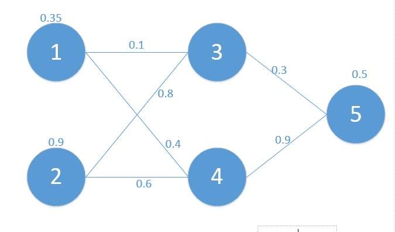

本文为[知乎版本](https://zhuanlan.zhihu.com/p/24801814)的纠错和 markdown 版本
在学习深度学习相关知识，无疑都是从神经网络开始入手，在神经网络对参数的学习算法bp算法，接触了很多次，每一次查找资料学习，都有着似懂非懂的感觉，这次趁着思路比较清楚，也为了能够让一些像我一样疲于各种查找资料，却依然懵懵懂懂的孩子们理解，参考了梁斌老师的博客[BP算法浅谈（Error Back-propagation）](https://blog.csdn.net/pennyliang/article/details/6695355)（为了验证梁老师的结果和自己是否正确，自己python实现的初始数据和梁老师定义为一样！），进行了梳理和python代码实现，一步一步的帮助大家理解bp算法！

为了方便起见，这里我定义了三层网络，输入层（第0层），隐藏层（第1层），输出层（第二层）。并且每个结点没有偏置（有偏置原理完全一样），激活函数为sigmod函数（不同的激活函数，求导不同），符号说明如下：

<!-- more -->

| $W_{ab}$   | 代表的是结点 a 点结点 b 的权重    |
|--------------- | --------------- |
| $y_a$   | 代表结点 a 的输出值   |
| $z_a$   | 代表结点 a 的输入值   |
| $\delta_a$   | 代表结点 a 的错误(反向传播用到)   |
| C   | 最终损失函数   |
| $f(x) = \frac{1}{1+e^{-x}}$| 结点的激活函数   |
| $W2$|左边字母, 右边数字, 代表第几层的矩阵或者向量|

对应的网络如下:

其中对应的矩阵表示如下：
$$
X = Z_0 = \begin{bmatrix}
0.35 \\
0.9
\end{bmatrix}
$$
$$
y_{out} = 0.5
$$
$$
W0 = \begin{bmatrix}
w_{31} & w_{32} \\
w_{41} & w_{42}
\end{bmatrix} = \begin{bmatrix}
0.1 & 0.8 \\
0.4 & 0.6
\end{bmatrix}
$$
$$
W1 = \begin{bmatrix}
w_{53} & w_{54}
\end{bmatrix} = \begin{bmatrix}
0.3 & 0.9
\end{bmatrix}
$$
首先我们先走一遍正向传播, 公式与相应的数据对应如下：
$$
\begin{align*}
z1 &= \begin{bmatrix}
z_3 \\
z_4
\end{bmatrix} = W0 \times X = \begin{bmatrix}
w_{31} & w_{32} \\
w_{41} & w_{42}
\end{bmatrix} \times \begin{bmatrix}
x_1 \\
x_2
\end{bmatrix} \\
&= \begin{bmatrix}
w_{31} \times x_1 + w_{32} \times x_2 \\
w_{41} \times x_1 + w_{42} \times x_2
\end{bmatrix} \\
&= \begin{bmatrix}
0.1 \times 0.35 + 0.8 \times 0.9 \\
0.4 \times 0.35 + 0.6 \times 0.9
\end{bmatrix} \\
&= \begin{bmatrix}
0.755 \\
0.68
\end{bmatrix}
\end{align*}
$$

那么:
$$
\begin{align*}
y1 &= \begin{bmatrix}
y_3 \\
y_4
\end{bmatrix} = f(W0 \times X) = f\left(\begin{bmatrix}
w_{31} & w_{32} \\
w_{41} & w_{42}
\end{bmatrix} \times \begin{bmatrix}
x_1 \\
x_2
\end{bmatrix}\right) \\
&= f\left(\begin{bmatrix}
w_{31} \times x_1 + w_{32} \times x_2 \\
w_{41} \times x_1 + w_{42} \times x_2
\end{bmatrix}\right) \\
&= f\left(\begin{bmatrix}
0.755 \\
0.68
\end{bmatrix}\right) \\
&= \begin{bmatrix}
0.680 \\
0.663
\end{bmatrix}
\end{align*}
$$
同理可以得到:

$$
\begin{align*}
z2 &= w1 \times y1 = \begin{bmatrix} w_{53} & w_{54} \end{bmatrix} \times \begin{bmatrix} y_3 \\ y_4 \end{bmatrix} \\
&= \begin{bmatrix} w_{53} \times y_3 + w_{54} \times y_4 \end{bmatrix} \\
&= \begin{bmatrix} 0.801 \end{bmatrix}
\end{align*}
$$
$$
\begin{align*}
y2 &= f(z2) = f(w1 \times y1) = f\left(\begin{bmatrix} w_{53} & w_{54} \end{bmatrix} \times \begin{bmatrix} y_3 \\ y_4 \end{bmatrix}\right) \\
&= f\left(\begin{bmatrix} w_{53} \times y_3 + w_{54} \times y_4 \end{bmatrix}\right) \\
&= f\left(\begin{bmatrix} 0.801 \end{bmatrix}\right) \\
&= \begin{bmatrix} 0.690 \end{bmatrix}
\end{align*}
$$

那么最终的损失为:

$C=\frac{1}{2}(0.690-0.5)^2 =  0.01805$

这也就是我们的目标函数, 我们的目标就是通过调整权重矩阵W0和W1, 让损失函数C最小!
这里用的方法就是梯度下降法, 接下来看看如何进行反向传播
$$
\left\{
\begin{align*}
C &= \frac{1}{2}(y_2 - y_{out}) \\
y_2 &= f(z_2) \\
z_2 &= (w_{53} \cdot y_3 + w_{54} \cdot y_4)
\end{align*}
\right.
$$
那么我们可以通过链式法则, 求出损失函数C对$w_{53}$的偏导数:
$$
\begin{align*}
\frac{\partial C}{\partial w_{53}} &= \frac{\partial C}{\partial y_5} \cdot \frac{\partial y_5}{\partial z_5} \cdot \frac{\partial z_5}{\partial w_{53}} \\
&= (y_5 - y_{out}) \cdot f'(z_2) \cdot (1 - f(z_2)) \cdot y_3 \\
&= (0.69 - 0.5) \cdot (0.69) \cdot (1 - 0.69) \cdot 0.68 \\
&= 0.02763
\end{align*}
$$

其中 sigmod 函数的导数为:
$$
\begin{align*}
f(x) &= \frac{1}{1 + e^{-x}} \\
f'(x) &= -(\frac{1}{1 + e^{-x}})^2 \cdot (-e^{-x})\\
&= \frac{1}{1 + e^{-x}} \cdot (1 - \frac{1}{1 + e^{-x}}) \\
&= f(x) \cdot (1 - f(x))
\end{align*}
$$
同理可得:
$$
\begin{align*}
\frac{\partial C}{\partial w_{54}} &= \frac{\partial C}{\partial y_5} \cdot \frac{\partial y_5}{\partial z_5} \cdot \frac{\partial z_5}{\partial w_{53}} \\
&= (y_5 - y_{out}) \cdot f(z_5) \cdot (1 - f(z_5)) \cdot y_4 \\
&= (0.69 - 0.5) \cdot (0.69) \cdot (1 - 0.69) \cdot 0.663 \\
&= 0.02711
\end{align*}
$$
现在我们继续求其他的偏导数

$W_{31},W_{32},W_{41},W_{42}$

给出其中一个的求导过程, 其他的类似
$$
\left\{
\begin{aligned}
C &= \frac{1}{2}(y_5 - y_{out})^2 \\
y_5 &= f(z_5) \\
z_5 &= (w_{53} * y_3 + w_{54} * y_4) \\
y_3 &= f(z_3) \\
z_3 &= w_{31} * x_1 + w_{32} * x_2
\end{aligned}
\right.
$$
$$
\begin{align*}
\frac{\partial C}{\partial w_{31}} &= \frac{\partial C}{\partial y_5} * \frac{\partial y_5}{\partial z_5} * \frac{\partial z_5}{\partial y_3} * \frac{\partial y_3}{\partial z_3} * \frac{\partial z_3}{\partial w_{31}} \\
&= (y_5 - y_{out}) * f(z_5) * (1 - f(z_5)) * w_{53} * f(z_3) * (1 - f(z_3)) * x_1
\end{align*}
$$
最终的结果为:
$$
\left\{
\begin{aligned}
w_{31} &= w_{31} - \frac{\partial C}{\partial w_{31}} = 0.09661944 \\
w_{32} &= w_{32} - \frac{\partial C}{\partial w_{32}} = 0.78985831 \\
w_{41} &= w_{41} - \frac{\partial C}{\partial w_{41}} = 0.39661944 \\
w_{42} &= w_{42} - \frac{\partial C}{\partial w_{42}} = 0.58985831
\end{aligned}
\right.
$$
