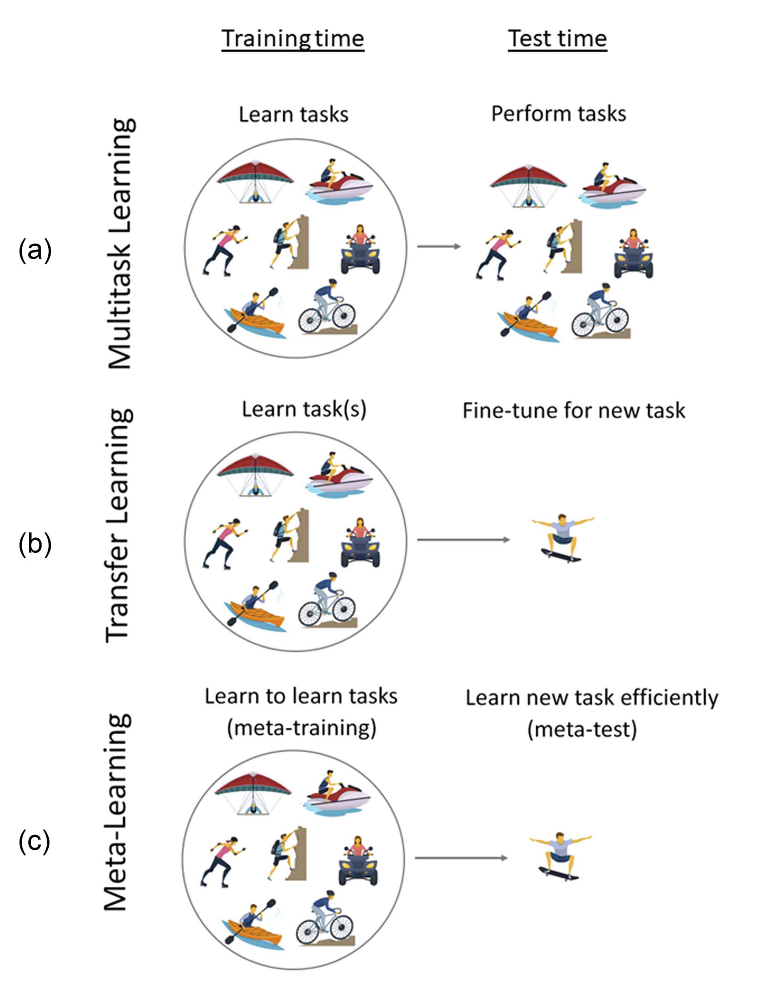

元学习主要是学习如何学习, 可以用少量的样本就能快速适应新任务.

主要解决的问题为:

1. 从多模态任务中学习
2. 没有任务信息时学习
3. 在 client 没有共享信息时学习
4. 在不同的分布中适应
5. 从一个流式任务中学习

## 1. 元学习的基本概念

$\theta$ 表示模型的参数

$\mathcal{D}=\{(x_i, y_i)\}$ 表示训练数据集, 其中的 $x_j$ 是从分布 $p(x)$ 中采样的输入, $y_j$ 是从$p(y|x)$ 中采样的输出.

$\mathcal{L}(\cdot, \cdot)$ 表示损失函数, 例如 $\mathcal{L}(\theta, \mathcal{D})$

$\mathcal{T}$ 表示一个任务

## 多任务学习,迁移学习和元学习

多任务学习( Multitask) 的目的是学习多个任务, 用以改善在一系列相关任务的能力.

迁移学习( Transfer Learning) 的目的是将从一个任务中学到的知识应用到另一个任务中. 通过微调一个预训练模型, 使其适应新任务.

相比之下, 元学习是从过去的任务中学习有用的知识和利用这些知识来让学习新任务更快.

### 多任务学习

多任务学习是同时学习多个有关的任务, 利用多个任务之间的共享结构, 相比于学习单个任务, 这样可以提高模型的整体能力.

#### 硬参数共享

常用的 MTL 方法是通过硬共享参数来实现的, 将参数分为所有任务共享的参数 $\theta^{sh}$ 和 每个任务独有的参数$\theta^i$ 两部分, 这些参数将会在训练中同步更新.

这种方法通常会采用多头神经网络结构, 一个共享的 encoder 网络$\theta^{sh}$用以提取通用的特征, 随后会分出多个对特定任性的 decoder 网络 $\theta^i$.

#### 软参数共享

软参数共享是另外一种 MTL 方法, 这种方法是通过正则惩罚来鼓励不同的任务模型, 让他们的参数彼此相近.

在这种方法下, 每个任务都有自己的模型参数$\theta^i$, 与之相应的, 共享的参数$\theta^{sh}$ 就可以为空了.

目标函数和更共享是相似的, 但是会增加一个正则项, 用以任务之间的参数共享.正则的强度决定于超参数 $\lambda$.

$$
\min_{\theta^{\text{sh}}, \theta^1, \ldots, \theta^T} \sum_{i=1}^T w_i \mathcal{L}_i(\{\theta^{\text{sh}}, \theta^i\}, \mathcal{D}_i) + \lambda \sum_{i'=1}^T \|\theta^i - \theta^{i'}\|
$$

不过也正是因为软参数共享是通过正则来实现的, 每个任务的参数都是单独储存的, 所以会有更大的内存开销

#### 没看懂

没懂在干什么,贴上原文

Another approach to sharing parameters is to condition a single model on a task descriptor zi that contains task-specific information used to modulate the network’s computation. The task descriptor zi can be a simple one-hot encoding of the task index or a more complex task specification, such as language description or user attributes. When a task descriptor is provided, it is used to modulate the weights of the shared network with respect to the task at hand. Through this modulation mechanism, the significance of the shared features is determined based on the particular task, enabling the learning of both shared and taskspecific features in a flexible manner. Such an approach grants fine-grained control over the adjustment of the network’s representation, tailoring it to each individual task. Various methods for conditioning the model on the task descriptor are described in . More complex methods are also provided in.

#### 总结

综点, 多任务学习的目前主要是学习多个任务. 可以处理从这 T 个任务中的新数据, 但不能处理新任务的数据

### 迁移学习

迁移学习是通过学习一个或多个源任务来解决目标任务. 主要的目标是通过学习已有的任务, 来提升在新任务上的表现. 主要是因为目标任务的数据较少, 不过虽然如此, 源任务的数据我们也是很难拿到的, 所有目前的一个通常的方法是微调.

#### 微调

微调是把在 $\mathcal{D}_S$ 上预训练的模型, 在 $\mathcal{D}_T$ 上继续训练.
但是微调也是有问题的, 比如说会把初使特征破坏, 所以通常会把学习率调小, 冻结前面的层, 或者只微调最后几层.
> [!NOTE]
> 最近有研究表明, 微调第一层或中间层的效果能有更好的效果[^lee2023].

还有一种方法是加入一个中间步骤, 在大量的标注数据上进行预训练, 可以减少性能的下降[^J2018]

有研究表明, 在目标数据过小的时候或和原数据集相差过大的时候, 微调可能并不会很有效,

### 元学习

元学习在训练阶段, 会从一缰训练任务$\mathcal{T}_{i}$中提取出能帮助学习新任务的先验知识. 具体的方法是使用一个包含数据集的元数据集, 每个数据集包含一个不同的训练任务.

在测试阶段, 小的训练数据集会被认为是一个完全新的任务, 和之前的知识一起用来推断最有可能的后验参数.

虽然数据集来自不同的数据分布(因为他们来自不同的任务), 但假设这些任务本身是从一个潜在的任务分布独立同分布抽取的, 这意味着任务结构之间存在一定的相似性.

[^lee2023]: Y. Lee et al., "Surgical fine-tuning improves adaptation to distribution shifts," in *Proc. Workshop Distrib. Shifts: Connecting Methods Appl.*, 2023, pp. 1–14.

[^J2018]: J. Phang, T. Févry, and S. R. Bowman, “Sentence encoders on stilts: Supplementary training on intermediate labeled-data tasks,” 2018, arXiv:1811.01088.
